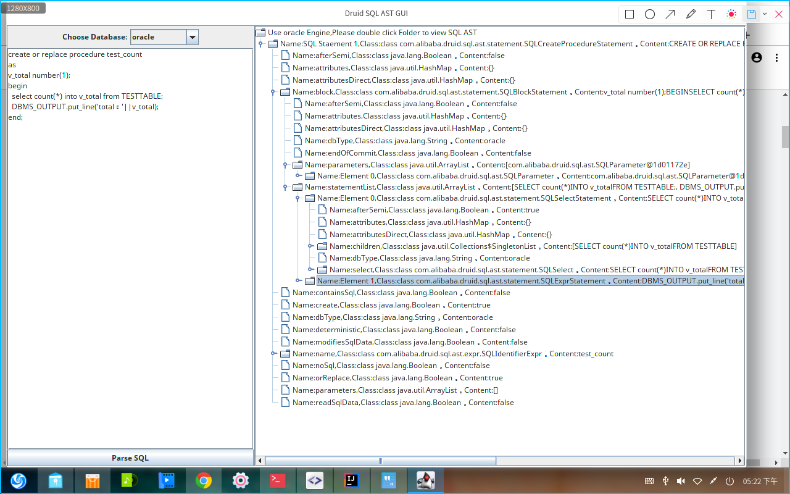

# Druid SQL AST GUI
Druid SQL AST 语法树展现小工具  
Druid SQL AST GUI (java swing)  

  
   

# Introduction
- https://github.com/snoopyhzy/druid-sql-ast-gui.git
- cd druid-sql-ast-gui && mvn package
- java -jar target/druid-sql-ast-gui-1.0-SNAPSHOT.jar
- have fun.
# SCREEN SHOT

----
# Aboud Druid SQL AST

# 请参与投票
* 2019最受欢迎中国开源软件评选投票 https://www.oschina.net/project/top_cn_2019 请参与投票
* 选择fastjson & druid

# druid

  

Introduction
---

- git clone https://github.com/alibaba/druid.git
- cd druid && mvn install
- have fun.

Documentation
---

- 中文 https://github.com/alibaba/druid/wiki/%E5%B8%B8%E8%A7%81%E9%97%AE%E9%A2%98
- English https://github.com/alibaba/druid/wiki/FAQ
- Druid Spring Boot Starter https://github.com/alibaba/druid/tree/master/druid-spring-boot-starter
